[TOC]


# OnSite非结构化工具

针对自动驾驶运输车在非结构化道路上进行测试是一项极为重要且极富挑战性的任务。这种测试专注于评估自动驾驶系统在矿区环境中的可靠性和适应能力。非结构化道路充满了各种挑战，包括陡峭的坡道、突如其来的障碍物，以及复杂多变的地形。鉴于这些挑战，OnSite平台研发了一套针对**非结构化道路的回放测试工具（即将发布）**。


## 1 场景格式介绍


### 1.1 静态高精度地图（HD-Map）格式介绍

>  静态高精度地图（HD-Map）由**高精度语义地图** 和 **表示可行驶区域的位图\栅格图(Bitmap\Raster Map)**  组成。


#### 1.1.1 高精度语义地图介绍

> + 高精度语义地图：主要包括一个特定区域（非结构化道路）的几何图层和语义图层，并对每个图层的位置做了精准表示。几何图层包括：`"node"`  、  `"node_block"`  、 `"polygon"`；语义图层包括： `"road"` 、`"intersection"` 、`"loading_area"` 、`"unloading_area"` 、`"road_block"` 、`"dubins_pose"` 、`"reference_path"` 、`"borderline"`  。
> + 几何图层与语义图层都通过`token`字段作为唯一标识符来管理，保证每个元素在系统内部的唯一性。
> + 对语义地图文件`xxxx_semantic_map.json`, 按照图层分别进行介绍：


##### 1.1.1.1 地图相关坐标信息

- 一些地图相关信息，主要包括：

  ```json
  "version":"1.5",       // 地图版本号
  "map_make_date":"2023-10-10",       // 地图制作日期
  "infomation_of_map":"****",
  "CoordinateReferenceSystem":{
        "CRS_name":"GCS_WGS_1984_UTM_Zone_50N",       // 坐标参考系名称
        "unit":"m"
  },
  "local_origin_utm_xy":[0000.0000,0000.0000],       // 地图原点的UTM坐标，脱密处理，已经去掉
  "local_origin_lonlat":[0000.0000,0000.0000],       // 地图原点的经纬度，脱密处理，已经去掉
  ```

  > 注1：  `"local_origin_utm_xy" ` 、 `“local_origin_lonlat”` 字段涉及具体地理信息，已经去掉，做脱密处理。
  >
  > 注2： 地图中各图层遵循统一的笛卡尔坐标系（o-xy）定义——
  >
  > - 原点o：为(x=0.0,y=0.0)，原点的UTM坐标（在全球地理UTM投影坐标系中的坐标值记录在 `"local_origin_utm_xy"`字段）已经去掉；
  > - x轴：与地理的正东方向对应，单位，米；
  > - y轴：与地理的正北方向对应，单位，米；
  > - 航向：表示车辆、waypoint、dubins_pose等含有位姿信息的航向统一定义为东偏北, 范围为[0,2pi)，单位，rad； 

- 表示可行驶区域的位图\栅格图·(Bitmap\Raster Map)坐标信息：

  ```json
  "bitmap_mask_PNG":{
        "png_version":"****",
        "UTM_info":{
              "point_southwest":[190.7206,814.0775],   //mask图的左下角\西南角坐标
              "point_northeast":[1661.4206,3840.4775],        // mask图的右上角\东北角坐标
              "local_x_range":[190.7206,1661.4206],        // mask图占据x轴的坐标范围
              "local_y_range":[814.0775,3840.4775],        // mask图占据y轴的坐标范围
              "unit":"m"
        },        // 表示可行驶区域的mask图局部UTM坐标信息（相对于地图原点而言）
        "canvas_edge_meter":[1470.7,3026.4],        // mask图x方向、y方向（对应画布长、高）的地理尺寸
        "canvas_edge_pixel":[14707,30264],       // mask图x方向、y方向（对应画布长、高）的像素尺寸
        "scale_PixelPerMeter":10,       // mask图关于像素坐标/地理坐标/的比例尺
        "scale_MeterPerPixel":0.1      // mask图关于地理坐标/像素坐标/的比例尺
  }, 
  ```


##### 1.1.1.2 几何图层

几何图层：主要包括`"node"`  、  `"node_block"`  、 `"polygon"` 三个几何图层，分别记录了组成多边形的角点、组成道路阻塞多边形的角点、多边形三种几何信息。

- node：记录了组成多边形图层 `"polygon"` 的角点数据。

  ```json
  "node":[
  		{
  			"token":"node-0",      // 几何图层node的唯一标识符
  			"x":719.3425,
  			"y":2686.3676
  		},
  		{
  			"token":"node-1",
  			"x":691.3078,
  			"y":2667.3252
  		},
    ******
   ]
  ```

  

- node_block：记录了组成**道路阻塞多边形**的角点数据；数据格式同node图层。

  ```json
  "node_block":[
  		{
  			"token":"nodeblock-0",    // 几何图层node_block的唯一标识符
  			"x":932.298,
  			"y":2018.3815
  		},
  		{
  			"token":"nodeblock-1",
  			"x":943.999,
  			"y":2015.9606
  		},
    	******
  		]
  ```


> 注：道路阻塞多边形构成了`"road_block"` 语义图层，表示非结构化道路某些路段被封闭信息，如下图所示：

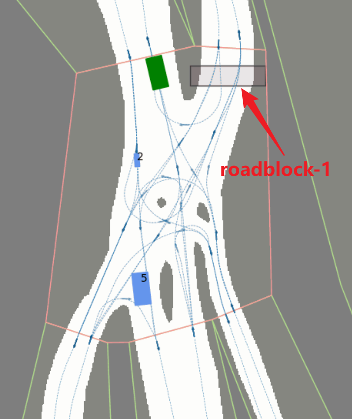

<center>图1 "road_block"图层某道路阻塞区域的地图可视化</center>

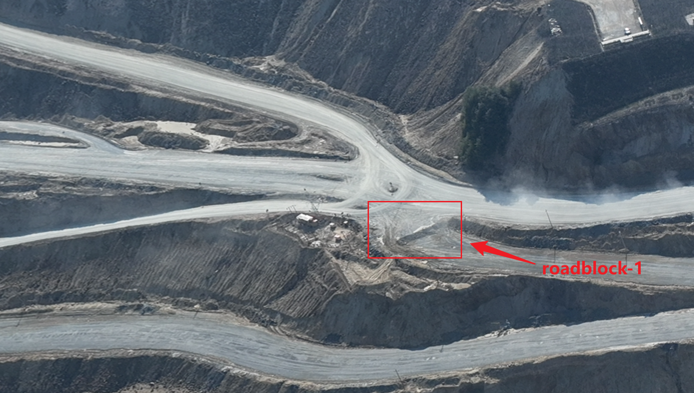

<center>图2 "road_block"图层某道路阻塞区域的实际场景</center>

- polygon：记录了多边形信息，每个多边形由多个闭合的node组成，每个多边形归属于唯一的 `"road"` 、`"intersection"` 、`"loading_area"` 、`"unloading_area"` 等语义图层的某个元素。

```json
"polygon":[
		{
			"token":"polygon-0",      // 几何图层polygon的唯一标识符
			"type":"intersection",        // polygon的类型：可选"road" 、"intersection"`、"loading_area" 、"unloading_area" 
			"link_node_tokens":[
				"node-0",
				"node-1",
				"node-2",
				"node-3",
				"node-4",
				"node-5",
				"node-6"
			],        // 几何图层polygon关联的node图层的node_tokens，构成闭合的多边形
			"link_borderline_tokens":[
				"borderline-0",
				"borderline-150",
				"borderline-160"
			],        // 几何图层polygon关联的borderline图层的borderline_tokens，polygon内部包含多条borderline
			"link_dubinspose_tokens":[
				"dubinspose-48",
				"dubinspose-49",
				"dubinspose-50",
				"dubinspose-53",
				"dubinspose-54",
				"dubinspose-55",
				"dubinspose-56",
				"dubinspose-57",
				"dubinspose-58",
				"dubinspose-151"
			],        // 几何图层polygon关联的dubins_pose图层的dubinspose_tokens，polygon内部包含多个(或无)dubins_pose
			"link_referencepath_tokens":[
				"path-21",
				"path-22",
				"path-23",
				"path-24",
				"path-25",
				"path-26"
			]
		},        // 几何图层polygon关联的reference_path图层的referencepath_tokens，polygon关联了多条reference path
		 ******
	]
```


##### 1.1.1.3 语义图层

高精度语义地图中的语义图层包括： `"road"` 、`"intersection"` 、`"loading_area"` 、`"unloading_area"` 、`"road_block"` 、`"dubins_pose"` 、`"reference_path"` 、`"borderline"` ，表征非结构化道路场景丰富的语义信息 。各图层含义如下：

- road：记录了特定区域全部的road（道路行驶片段）语义划分信息。

  ```json
  "road":[
  		{
  			"token":"road-0",      // 语义图层road的唯一标识符
  			"link_polygon_token":"polygon-3"     // 关联到几何图层polygon的某个token
  		},
  		{
  			"token":"road-1",
  			"link_polygon_token":"polygon-4"
  		},
      ******
      ]
  ```

  > 注：下图3是多边形`"polygon"` 图层与 `"road"` 、`"intersection"`的对应关系：

  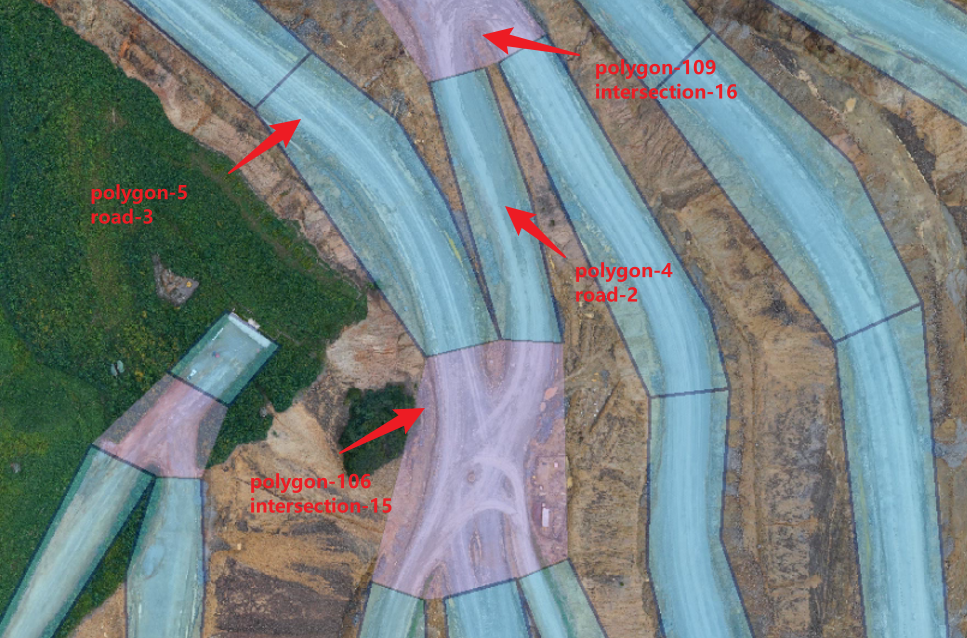

  <center>图3 多边形"polygon"图层与"road" 、"intersection"图层的在实际场景中的对应关系</center>

  

- intersection：记录了特定区域全部的intersection（交叉路口）语义划分信息。

  ```json
  "intersection":[
  		{
  			"token":"intersection-0",     // 语义图层intersection的唯一标识符
  			"link_polygon_token":"polygon-0"     // 关联到几何图层polygon的某个token
  		},
  		{
  			"token":"intersection-1",
  			"link_polygon_token":"polygon-1"
  		},
  		******
  		]
  ```

  

- loading_area：记录了特定区域全部的loading_area（运输车辆的装载区）语义划分信息。

  ```json
  "loading_area":[
  		{
  			"token":"loading-0",    // 语义图层loading_area的唯一标识符
  			"link_polygon_token":"polygon-97"   // 关联到几何图层polygon的某个token
  		}
  	],
  ```

  

- unloading_area：记录了特定区域全部的unloading_area（运输车辆的卸载区）语义划分信息。 

  ```json
  "unloading_area":[
  		{
  			"token":"unloading-0",    // 语义图层unloading_area的唯一标识符
  			"link_polygon_token":"polygon-10"   // 关联到几何图层polygon的某个token
  		},
  		{
  			"token":"unloading-1",
  			"link_polygon_token":"polygon-93"
  		}
  	],
  ```

  

- road_block：记录了特定区域全部的road_block（道路的阻塞区域）语义划分信息。具体场景见图1、图2。

  ```json
  "road_block":[
  		{
  			"token":"roadblock-0",   // 语义图层road_block的唯一标识符
  			"link_nodeblock_tokens":[
  				"nodeblock-0",
  				"nodeblock-1",
  				"nodeblock-2",
  				"nodeblock-3",
  				"nodeblock-4"
  			]  // 关联到几何图层node_block的多边形边界点nodeblock_tokens,构成闭合多边形
  		},
  		{
  			"token":"roadblock-1",
  			"link_nodeblock_tokens":[
  				"nodeblock-5",
  				"nodeblock-6",
  				"nodeblock-7",
  				"nodeblock-8",
  				"nodeblock-9"
  			]
  		},
    	******
    	]
  ```

  

- dubins_pose：两个用以表示raod连通关系，并作为生成参考路径的**控制点（control point）**序列。

  ```json
  "dubins_pose":[
  		{
  			"token":"dubinspose-0",     // 语义图层dubins_pose的唯一标识符
  			"x":949.1702,
  			"y":2195.1654,
  			"yaw":1.6197,      //  dubins_pose的位姿点的航向, 方向定义x轴偏y逆时针为正, [0,2pi),单位 rad；
  			"dubinspose_type":"normal",    //  dubins_pose的类型：三种类型，"normal"，"split"，"merge"；
  			"link_polygon_type":"intersection",   //  关联的多边形polygon类型 ，指的是在哪一个多边形内部；
  			"link_polygon_token":"polygon-106"  //  关联的多边形polygon token
  		},
  		{
  			"token":"dubinspose-1",
  			"x":940.249,
  			"y":2220.8395,
  			"yaw":3.0039,
  			"dubinspose_type":"normal",
  			"link_polygon_type":"intersection",
  			"link_polygon_token":"polygon-106"
  		},
    ******
    ]
  ```

  > 注：dubins_pose图层的`"dubinspose_type"`字段： 记录"normal"，"split"，"merge"三种类型，主要用途是区分参考路径（`reference_path`图层）连接关系，方便进行参考路径索引，具体含义如下图所示：
  >
  > - "normal"：普通的dubins_pose，上游和下游的参考路径只有1条；
  > - "split"：分离的dubins_pose，上游参考路径**只有1条**；下游的参考路径**大于1条**；
  > - "merge”:	分离的dubins_pose，上游参考路径**大于1条**；下游的参考路径**只有1条**；

  

  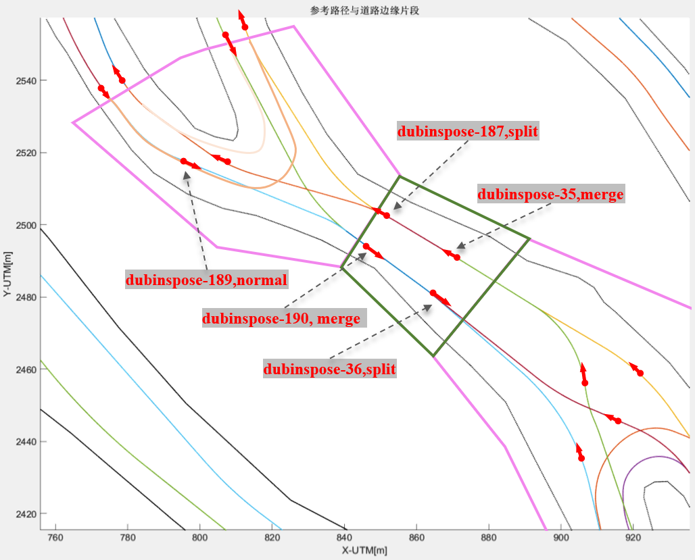

  <center>图4  杜宾斯dubins_pose图层"dubinspose_type"字段的类型区别</center>

- reference_path：记录了参考路径片段信息，reference_path图层的参考路径大多由dubins_pose（杜宾斯点）按照dubins曲线的方式生成；

  ```json
  "reference_path":[
  		{
  			"token":"path-0",   // 语义图层reference_path的唯一标识符
  			"type":"connector_path",   // 语义图层reference_path的类型：两类，"connector_path"，"base_path"；
  			"link_polygon_tokens":[
  				"polygon-12",
  				"polygon-106",
  				"polygon-5"
  			],    // 关联的polygon，该参考路径涉及到哪几个多边形polygon tokens
  			"link_dubinspose_tokens":[
  				"dubinspose-6",
  				"dubinspose-0",
  				"dubinspose-16",
  				"dubinspose-9"
  			],   //关联的dubins_pose tokens, 由这些杜宾斯点作为控制点生成参考路径； 
  			"incoming_tokens":[
  				"path-92"
  			],  // 该参考路径上游的参考路径tokens，若是该参考路径是首条，上游tokens为空；
  			"outgoing_tokens":[
  				"path-75"
  			],  // 该参考路径下游的参考路径tokens，若是该参考路径是末条，下游tokens为空；
  			"is_start_blocked":false,   // 该参考路径的起点是否被阻塞：true，代表路口road被阻塞；false，代表路口road未被阻塞；
  			"is_end_blocked":false,    //  该参考路径的终点是否被阻塞：true，代表路口road被阻塞；false，代表路口road未被阻塞；
  			"waypoint_sampling_interval_meter":0.2,    // 参考路径waypoint（航路点）间隔，0.2米；
  			"waypoints":[
  				[959.3132,2161.5661,1.9348,414.9717,2.2824],
  				[959.2417,2161.7529,1.9379,414.9835512,2.2824],
  				[959.1696,2161.9395,1.941,414.9922312,2.2938],
  				***  //其它参考路径的waypoint信息；
          		]    //  参考路径的离散采样，航路点序列 waypoints，数组格式[x坐标, y坐标, yaw航向, height海拔高度, slope坡度]，单位[m, m, rad, m, degree]；
          },
          ******    // 更多参考路径片段：path-1,path-2,......
          ]
  ```

  

  > 注1：基于dubins曲线生成的参考路径其曲率天然具有突变特点，且参考路径未进行后端优化（未考虑曲率约束、与边界的碰撞约束等），理论上不适合直接作为实时路径来跟车行驶。因此需要用户自车进行实时路径规划，这里仅作为参考。
  >
  > 注2： 语义图层reference_path的类型：两类，"connector_path"，"base_path"；如图5所示。
  >
  > - "connector_path"：intersection内部的参考路径，该类型路径用于表示road与road之间的连通路径；
  > - "base_path"：road内部的参考路径，该类型路径用于表示road内的基础路径，一般类似于普通道路双向双车道的车道中心线；

  

  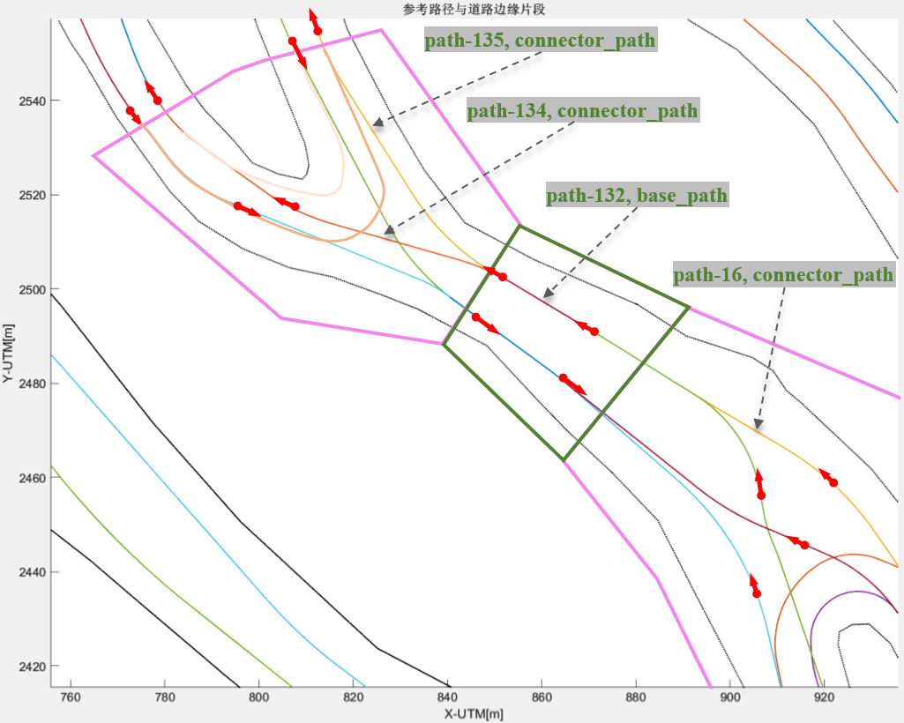

  <center>图5  参考路径的"connector_path"与"base_path"类型区别</center>

  

- borderline：记录了道路边界线信息，该边界线由地图采集车在实际道路离线采集并经过处理生成，该边界线与可行驶区域栅格图（`xxxx_bitmap_mask.png`）的黑白边界重合。

```json
"borderline":[
		{
			"token":"borderline-0",   // 语义图层borderline的唯一标识符
			"type":"edge",    // 语义图层borderline的类型：两类，"edge",   "inner" ；
			"link_polygon_token":"polygon-0",    //该道路边界线归属于哪一个多边形polygon token；
			"borderpoint_sampling_interval_meter":0.5,    // 某条borderline进行离散采样，borderpoint采样间隔，0.5米；
			"borderpoints":[
				[662.7880,2659.5053,403.6998],
				[662.6747,2659.8672,403.6998],
        		   ***  //其它参考路径的waypoint信息；
        		]    //  某条borderline的离散采样序列 borderpoints，数组格式[x坐标, y坐标, height海拔高度, slope坡度]，单位[m, m, m]；
        },
        ******    // 更多道路边界线片段：borderline-1,borderline-2,......
        ]
```

> 注1：语义图层borderline（道路边界线）的类型：两类，"edge",   "inner" ；如图6所示。
>
> - "edge"：道路两侧的边界；通常是不闭合的；
> - "inner"：道路内部的“挡墙”分割，或者道路内部的转盘；通常在道路内部闭合；

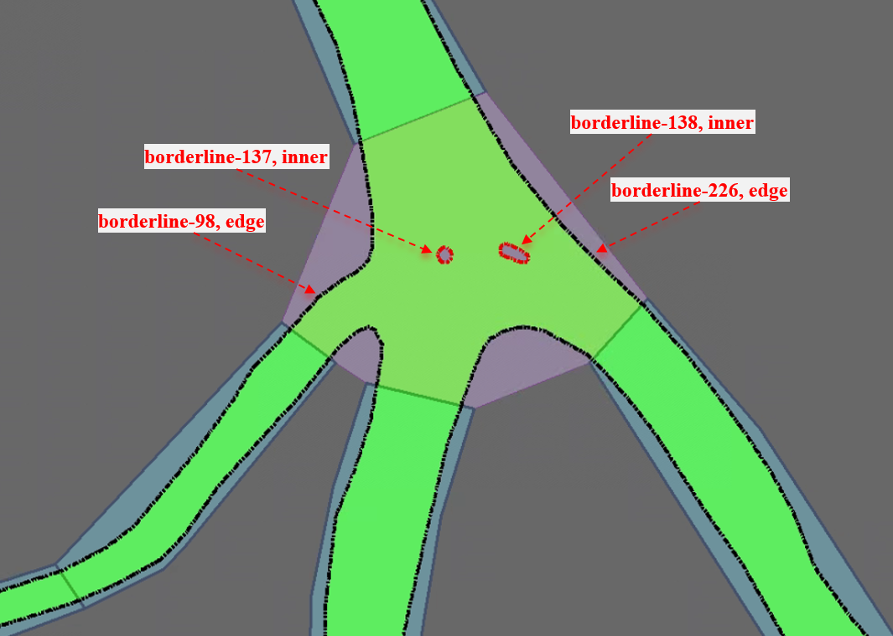

<center>图6  道路边界线的"edge"与"inner"类型区别</center>

#### 1.1.2 可行驶区域栅格图介绍

非结构化道路（非公路）与结构化公路的主要区别：非结构化道路无结构化的车道划分、道路边界不规则。因此，使用高分辨率的位图\栅格图(Bitmap\Raster Map) 数据可以最大程度的保留道路可行驶区域，如图7所示。

- 位图文件：`xxxx_bitmap_mask.png`;

- 像素(栅格)储存信息为0或1，表示非道路区域和道路区域；

- 像素坐标pixel与地理坐标meter对应关系记录在高精度语义地图(``xxxx_semantic_map.json`)中的`"bitmap_mask_PNG"`字段；


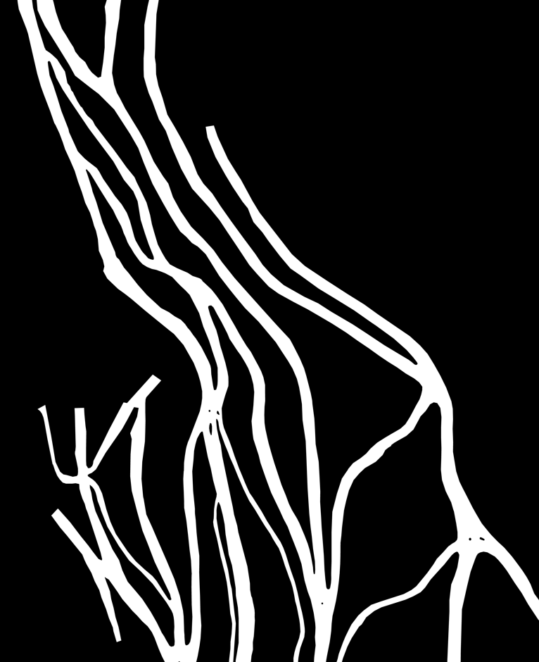

<center>图7  表示可行驶区域栅格图的示例</center>


### 1.2 动态场景（Scenarios）格式介绍

动态场景文件记录了局部的（交叉路口）多车交通场景中状态信息，主要包括每辆车在每个离散周期0.1s的状态信息，如下：

- 动态场景文件：`Scenarios-xxxx.json`;

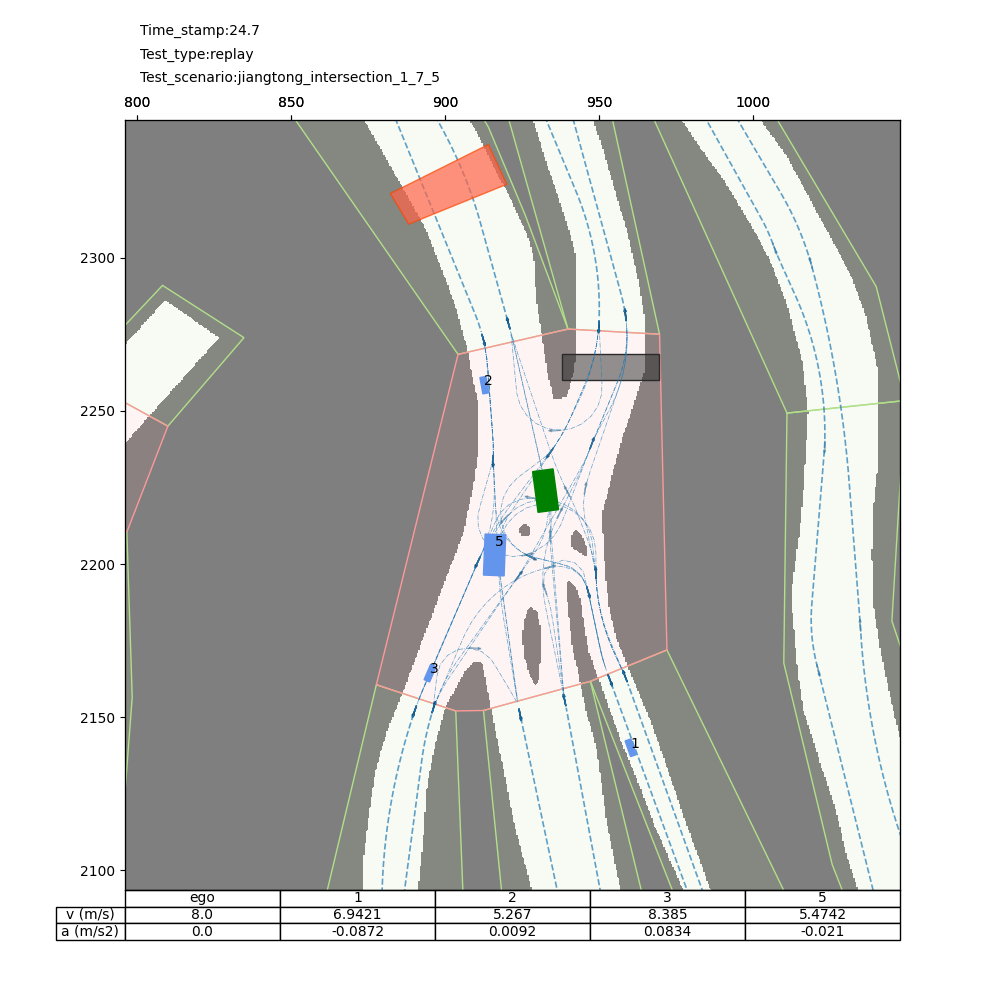

<center>图8  OnSite-Mine仿真环境中动态交通场景在24.7s时刻的可视化</center>


### 1.3 其它信息介绍

为了便于理解OnSite-Mine 非结构化道路场景在特定区域内的全场景信息，给出以下fig图辅助理解：

+ 图9某特定区域2D道路边界线展示图
+ 图10某特定区域3D道路边界线展示图
+ 图11某特定区域2D参考路径展示图
+ 图12某特定区域3D参考路径参展图

- 图13某特定区域内部实际道路场景的航拍图


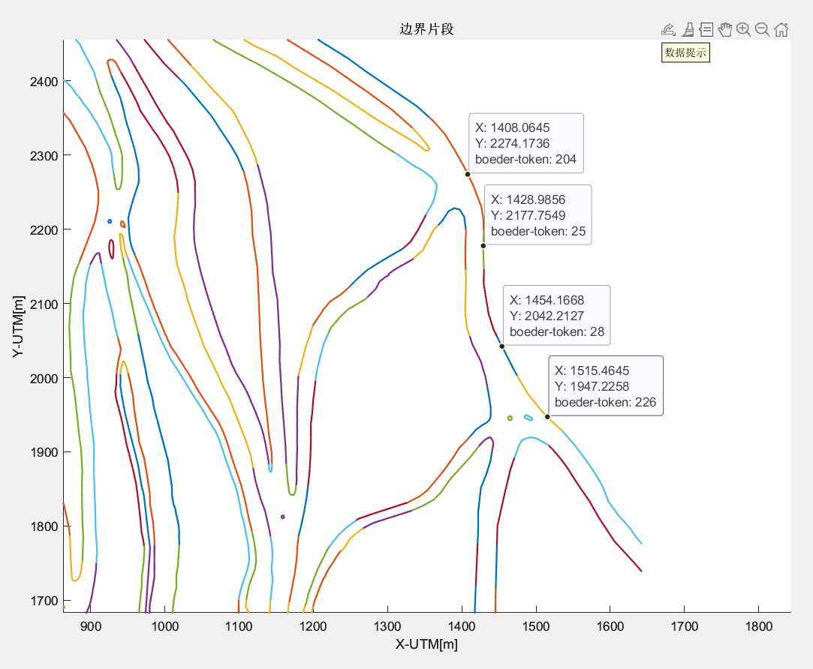

<center>图9  xxxx_borderline_2D道路边界线的二维示意图</center>


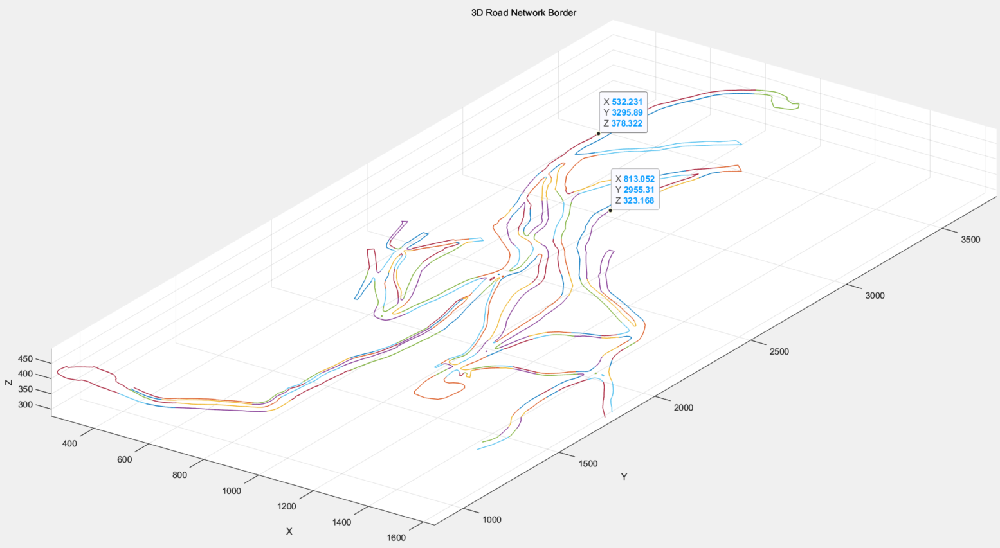

<center>图10  xxxx_borderline_3D 道路边界线的三维示意图</center>


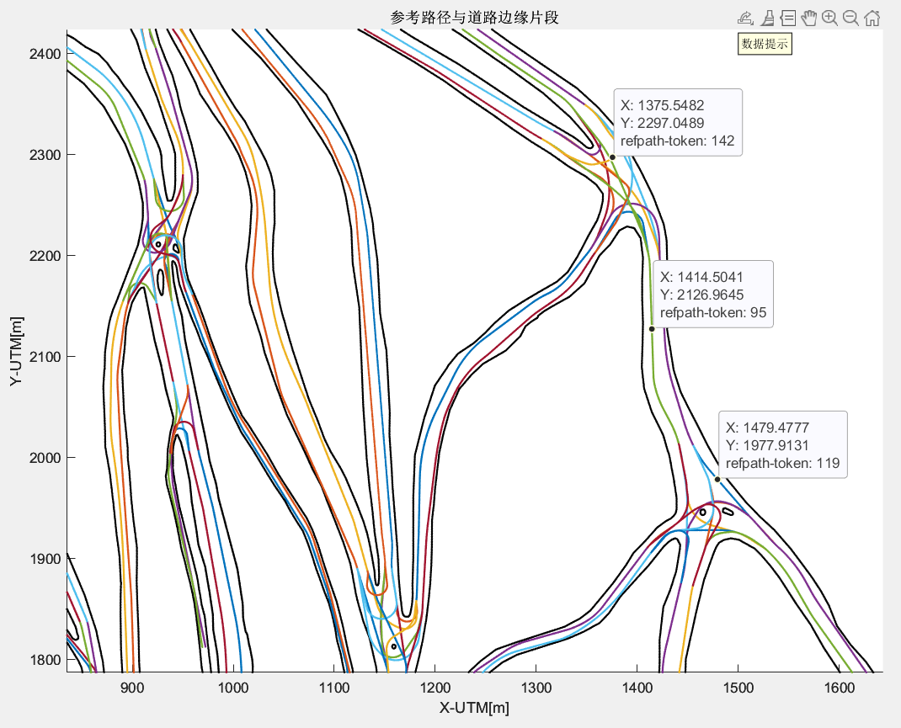

<center>图11  borderline_referencepath_2D 参考路径二维示意图</center>


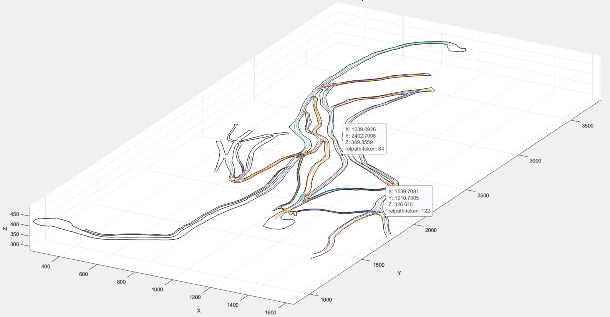

<center>图12  borderline_referencepath_3D 参考路径三维示意图</center>


<center>图13 特定区域内部实际道路场景的航拍图示例</center>


## 2 测试环境介绍

平台将提供基于python开发的第三方库**OnSite-Mine（即将发布）**作为测试环境，同时提供包括**评价、可视化**等一系列辅助工具。**OnSite-Mine**作为一个自主开发的仿真环境，能够与选手的规划决策算法进行交互，使得算法能够接收环境和背景车信息，并据此进行自主决策输出，仿真环境则根据此输出完成对主车和背景车辆状态的更新，此过程不断循环直至仿真结束。


### 2.1 碰撞检测模块

+ 仿真过程中需要进行严格的碰撞检测，包括主车与背景车的碰撞检测以及主车与可行驶区域边界的碰撞检测，任何碰撞都将导致仿真过程立即终止。

#### 2.1.1 主车与背景车碰撞

主车与背景车的碰撞检测采用**OBB（Oriented Bounding Box）方法**，碰撞案例见图14

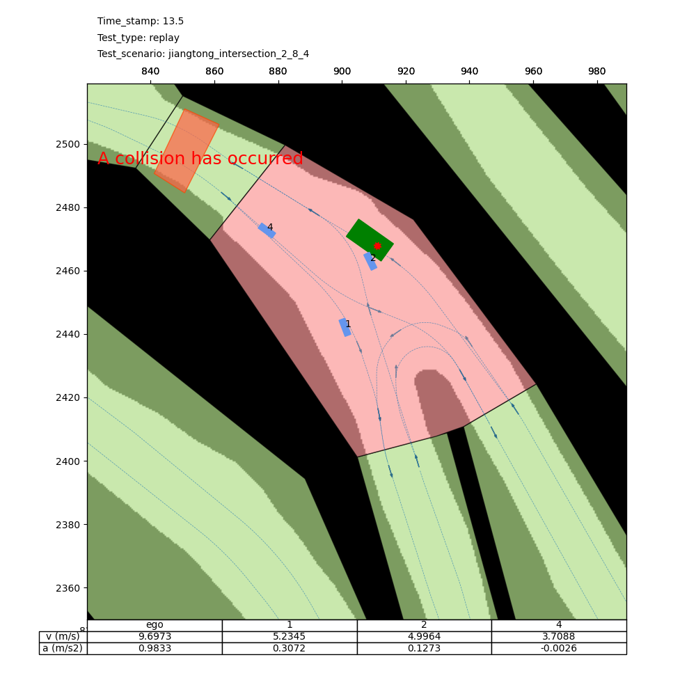

<center>图14 主车与背景车的碰撞案例图</center>


#### 2.1.2 主车与可行驶区域边界碰撞

主车与可行驶区域的碰撞检测采用一种**基于网格的离散化碰撞检测算法**，碰撞案例见图15

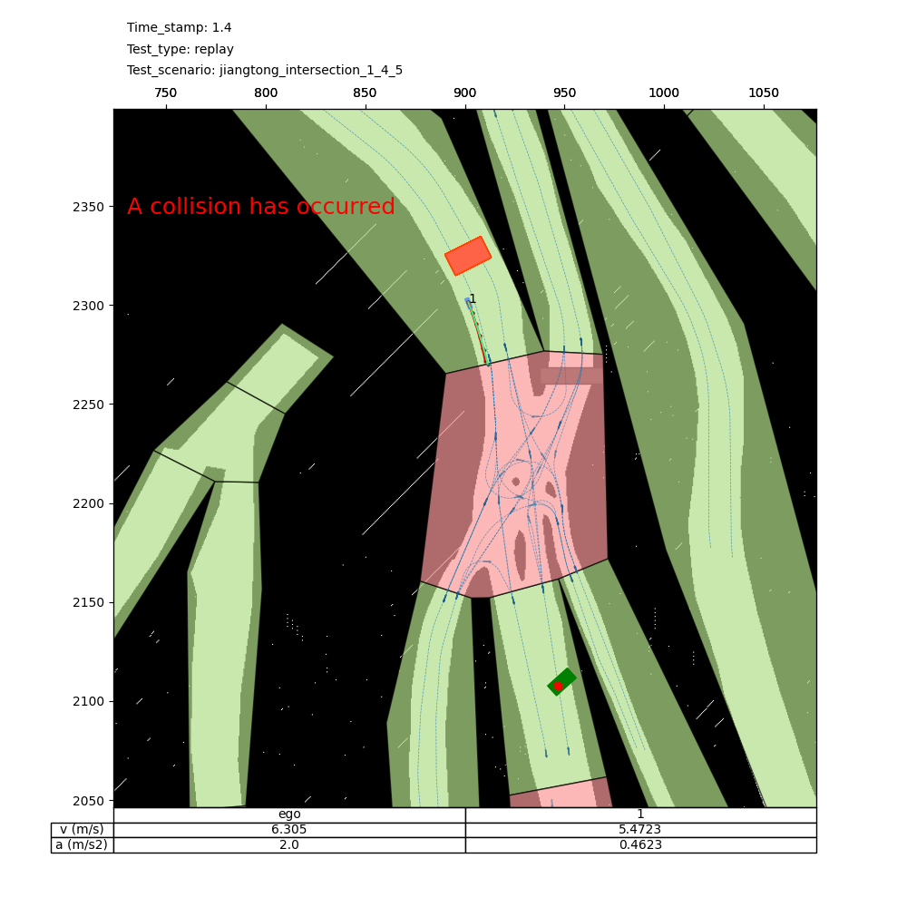

<center>图15  主车与可行驶区域碰撞案例图 </center>

### 2.2 自车状态更新逻辑

> 目前采用基础的自行车模型，后续考虑修改为更加复杂、符合重型运输车辆的动力学模型。

环境根据前向欧拉的规则更新，采用运动学自行车模型，当 t→t+Δt 时刻，得到自车加速度α与方向盘转角δ作为输入，按照以下步骤更新车辆状态：


#### 2.2.1 更新自车位置

$$
\begin{aligned}
	&x_{t+\Delta t}=x_t+v_t\times \cos \left( \theta _t \right) \times \Delta t\\
	&y_{t+\Delta t}=y_t+v_t\times \sin \left( \theta _t \right) \times \Delta t\\
\end{aligned}
$$

其中：

- $x_t,y_t$ 为当前时刻车辆的x与y坐标
- $x_{t+\Delta t},y_{t+\Delta t}$为下一时刻车辆的x与y坐标
- $v_t$为当前时刻的车辆速度
- $\theta_t$为当前时刻的车辆偏航角
- $\Delta t $为一个步长的时间长度, 环境更新周期

#### 2.2.2  更新自车偏航角

$$
\theta _{t+\Delta t}=\theta _t+v_t/l\times \tan\mathrm{(}\delta )\times \Delta t
$$

其中：

- $\theta _{t+\Delta t}$ 为下一时刻的车辆偏航角
- $\delta$为方向盘转角
- $l$为车辆轴距，我们取其为值为：车辆长度 ÷ 1.7。

未说明的符号，含义与前文一致。

#### 2.2.3 更新自车速度

$$
v_{t+\Delta t} = v_t + a *\Delta t
$$

其中：

- $v_{t+\Delta t}$为下一时刻的车辆速度
- $a$为加速度

未说明的符号，含义与前文一致。

> 自车速度阈值：最大为13.5m/s(约48Km/h)。

#### 2.2.4 车辆参数

>  平台目前仅提供一种主车类型，具体参数如下（后续会拓展）：


**（1）类型1**

车辆外形参数：

```json
"VehicleShapeInfo":{
			"vehicle_type":"XG90G",
			"length":9.0,
			"width":4.0,
			"height":3.5,
			"min_turn_radius":12,
			"wheel_base":5.15,
			"locationPoint2Head":6.5,
			"locationPoint2Rear":2.5
		},
```

轮廓尺寸见下图：

> 车型参考：https://www.xcmg.com/product/product/pro-detail-120794.htm


## 3 评价体系介绍

OnSite-mine赛题的评价体系主要包含了**安全性、效率性**两个维度，在非结构化道路运输上车辆一般不特别关注舒适性。安全性、效率性满分分别为60分、40分，总分为100分。制定评分细则如下：

表1 评分细则（非结构化道路交叉口运输车辆单车通行场景）

|    指标项    |            指标            |  分值  |                        得分标准                        |
| :----------: | :------------------------: | :----: | :----------------------------------------------------: |
| 安全（60分） |        与其它车碰撞        | 扣分制 |                  若碰撞，安全分为0分                   |
|     安全     |     **与道路边界碰撞**     | 扣分制 |                  若碰撞，安全分为0分                   |
|     安全     | 安全距离：与前车的TTC阈值  | 扣分制 |     单个场景中，低于TTC阈值的时长/总行驶时长*20分      |
|     安全     | 安全距离：侧向安全距离阈值 | 扣分制 | 单个场景中，低于侧向安全距离阈值的时长/总行驶时长*20分 |
|     安全     |         侧向加速度         | 扣分制 |        侧向加速度超出阈值的时长/总行驶时长*20分        |
| 效率（40分） |          任务完成          | 扣分制 |                  若任务未完成，扣20分                  |
|     效率     |          任务耗时          | 扣分制 |                （期望耗时/总耗时）*20分                |

注1：每个部分总分扣完即止。

注2：若主车在行驶过程中出现算法失效(无法提供完整轨迹结果)的情况，则各项分数全部为0。

注3：针对被控对象为大型运输车辆（尤其满载工况），在非结构化道路行驶若侧向加速度过大，容易发生侧翻。设定侧向加速度的安全阈值为0.4 m/s2和-0.4 m/s2 。  

注4：非结构化道路通常无特别密集的交通流，自车**与周围车保持足够的安全距离**是运输车辆必须关注的指标 。因此，设定了与前车的TTC阈值指标、与侧向车辆的侧向安全距离阈值指标，均采取扣分制。与前车的TTC阈值取值为3s，与侧向车辆的侧向安全距离阈值取值为0.8米（车辆外轮廓间的最小距离）。


## 4 工具介绍


**可视化工具**

仿真环境提供在回放测试过程中保存可视化结果的功能，同时用户可以根据自身需求进行二次开发

（1）基础可视化案例展示


（2）添加轨迹预测效果展示的可视化案例展示


## 5 后续工作

**非结构化仿真环境（OnSite-Mine）即将上线**